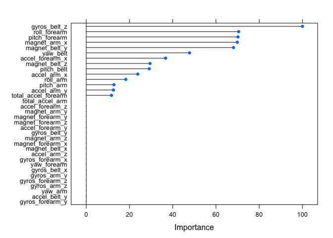
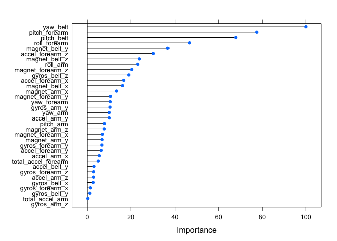
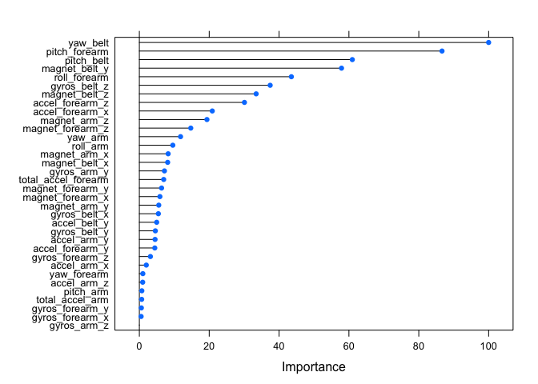

# Prediction of Weight Lifting Activity from Data Provided by Wearable Accelerometers
wdsteck  
`r format(Sys.Date(), "%B %d, %Y")`  

## Introduction

Using devices such as Jawbone Up, Nike FuelBand, and Fitbit it is now possible to collect a large amount of data about personal activity relatively inexpensively. These type of devices are part of the quantified self movement – a group of enthusiasts who take measurements about themselves regularly to improve their health, to find patterns in their behavior, or because they are tech geeks. One thing that people regularly do is quantify how much of a particular activity they do, but they rarely quantify how well they do it.

In this project, the goal is to use data from accelerometers on the belt, forearm, arm, and dumbell of 6 participants to create a prediction model determining which of the 6 different ways to lift the barbell is being used.

More information is available from [this website](http://groupware.les.inf.puc-rio.br/har) (see the section on the Weight Lifting Exercise Dataset).


```
## Loading required package: lattice
```

```
## Loading required package: ggplot2
```

## Data

The training data for this project are available here:
```R
https://d396qusza40orc.cloudfront.net/predmachlearn/pml-training.csv
```

The test data are available here:
```R
https://d396qusza40orc.cloudfront.net/predmachlearn/pml-testing.csv
```

## Read in the Data


```r
trainFile = "pml-training.csv"
trainURL = "https://d396qusza40orc.cloudfront.net/predmachlearn/pml-training.csv"
testFile = "pml-testing.csv"
testURL = "https://d396qusza40orc.cloudfront.net/predmachlearn/pml-testing.csv"

if (!file.exists(trainFile)) {
        download.file(trainURL, trainFile)
}
trainDat <- read.csv(trainFile, stringsAsFactors = TRUE)

if (!file.exists(testFile)) {
        download.file(testURL, testFile)
}
testDat <- read.csv(testFile, stringsAsFactors = TRUE)
```

## Clean Up the Data

We are instructed to use

> data from accelerometers on the belt, forearm, arm, and dumbell of 6 participants

so extract the appropriate features:


```r
filter = grepl("belt|arm|dumbell|classe", names(trainDat))
trainDat = trainDat[, filter]
testDat = testDat[, filter]
```

If a feature has any `NA` values, then remove the feature. Use the test data to
determine the columns to ensure the model can run on this data.


```r
filter = colSums(is.na(testDat)) == 0
trainDat = trainDat[, filter]
testDat = testDat[, filter]
```

Ensure that features are not mostly zero nor have zero variability. Any
features mostly zero or with zero variability should be eliminated.

```r
nearZeroVar(x = trainDat)
```

```
## integer(0)
```
`NearZeroVar()` returns no covariants that should be removed.

Investigate the correlations between the variables. If there are any
pairs of variables that are highly correlated, then remove one of them.


```r
corMatrix <- cor(trainDat[sapply(trainDat, is.numeric)])
highlyCor = findCorrelation(corMatrix, cutoff = .90)
highlyCor
```

```
## [1]  1 10  4  8 18
```

```r
trainDat <- trainDat[,-highlyCor]
testDat <- testDat[,-highlyCor]
```

## Split Data for Model Creation

Since the training data set is so large (19622 rows), split
the training set into a training set and a validation set.


```r
inTrain <- createDataPartition(trainDat$classe, p=0.7, list=F)
trainDat.train <- trainDat[inTrain,]
trainDat.valid <- trainDat[-inTrain,]
```

## Model Creation

Now that we have our data ready for model creation, try to create the model
using different generation methods to see which is more accurate.

### Regression Tree Method


```r
modFit.rpart <- train(classe ~ ., 
               data=trainDat.train,
               method="rpart")
```

```
## Loading required package: rpart
```

Once the model has been created, determine its accuracy in selecting
the correct activity by predicting each of the validation data samples
and compare them against the true activity.


```r
predicted <- predict(modFit.rpart, trainDat.valid)
confusionMatrix(trainDat.valid$classe, predicted)$table
```

```
##           Reference
## Prediction   A   B   C   D   E
##          A 864 225 407 175   3
##          B  25 580 375 159   0
##          C   0 416 456 153   1
##          D  11 190 178 503  82
##          E   1 340 165 203 373
```

```r
accuracy.rpart <- sum(predicted == trainDat.valid$classe) / length(predicted)
accuracy.rpart
```

```
## [1] 0.4717077
```

```r
ooser.rpart <- 1 - accuracy.rpart
ooser.rpart
```

```
## [1] 0.5282923
```

```r
plot(varImp(modFit.rpart))
```

<!-- -->

As expected, the accuracy of this model (47.171%) is very poor (out of sample error rate is high at 52.829%).

See if others can do better.

### Random Forest Method


```r
modFit.rf <- train(classe ~ ., 
               data=trainDat.train,
               method="rf",
               trControl=trainControl(method="cv", number=4),
               verbose=F)
```

```
## Loading required package: randomForest
```

```
## randomForest 4.6-12
```

```
## Type rfNews() to see new features/changes/bug fixes.
```

```
## 
## Attaching package: 'randomForest'
```

```
## The following object is masked from 'package:ggplot2':
## 
##     margin
```

Once the model has been created, determine its accuracy in selecting
the correct activity by predicting each of the validation data samples
and compare them against the true activity.


```r
predicted <- predict(modFit.rf, trainDat.valid)
confusionMatrix(trainDat.valid$classe, predicted)$table
```

```
##           Reference
## Prediction    A    B    C    D    E
##          A 1663    5    1    2    3
##          B    2 1127    8    1    1
##          C    2   11  998   10    5
##          D    0    0   10  952    2
##          E    0    0    0    1 1081
```

```r
accuracy.rf <- sum(predicted == trainDat.valid$classe) / length(predicted)
accuracy.rf
```

```
## [1] 0.9891249
```

```r
ooser.rf <- 1 - accuracy.rf
ooser.rf
```

```
## [1] 0.01087511
```

```r
plot(varImp(modFit.rf))
```

<!-- -->

The random forest accuracy is 98.912%, much better,
as expected, than the simple rpart model. Out of sample error rate is very low at
1.088%.

### Boosting Method


```r
modFit.gbm <- train(classe ~ ., 
               data=trainDat.train,
               method="gbm",
               trControl=trainControl(method="cv", number=4),
               verbose=F)
```

```
## Loading required package: gbm
```

```
## Loading required package: survival
```

```
## 
## Attaching package: 'survival'
```

```
## The following object is masked from 'package:caret':
## 
##     cluster
```

```
## Loading required package: splines
```

```
## Loading required package: parallel
```

```
## Loaded gbm 2.1.1
```

```
## Loading required package: plyr
```

Once the model has been created, determine its accuracy in selecting
the correct activity by predicting each of the validation data samples
and compare them against the true activity.


```r
predicted <- predict(modFit.gbm, trainDat.valid)
confusionMatrix(trainDat.valid$classe, predicted)$table
```

```
##           Reference
## Prediction    A    B    C    D    E
##          A 1619   31   11   12    1
##          B   48 1043   43    1    4
##          C    0   90  895   32    9
##          D    8    7   47  891   11
##          E    7   15   14   16 1030
```

```r
accuracy.gbm <- sum(predicted == trainDat.valid$classe) / length(predicted)
accuracy.gbm
```

```
## [1] 0.9308411
```

```r
ooser.gbm <- 1 - accuracy.gbm
ooser.gbm
```

```
## [1] 0.06915888
```

```r
plot(varImp(modFit.gbm))
```

<!-- -->

The boost model accuracy is 93.084%, not as good as
the random forest model. Out of sample error rate is very low at
6.916%.

# Conclusion

The accuracy of the random forest model (98.912%) is
very high. The Random Forest method of model selection has found
a very good prediction model of exercise behavior.

Now, we can predict the outcomes of the test data using the model.


```r
predict(modFit.rf, testDat)
```

```
##  [1] B A B A A E D B A A B C B A E E A B B B
## Levels: A B C D E
```

